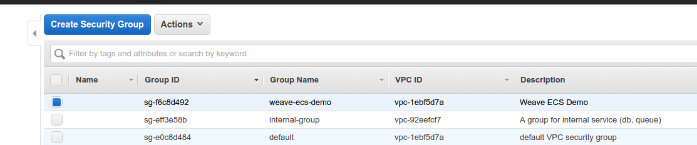

# A completed deployment tutorial

## Requirements

* AWS cli
    [online doc](https://docs.aws.amazon.com/cli/latest/userguide/cli-chap-getting-started.html)
* Docker
    [official doc](https://docs.docker.com/engine/installation/)
* git
    [official website](https://git-scm.com/)

## Start

### Download and Deploy

```
git clone git@github.com:Wen777/microservices-demo.git
cd microservices-demo/deploy/aws-ec
git checkout origin/customize
STORE_DNS_NAME_HERE=ecs-endpoint ./setup.sh
```

### Manually configure

After the deployment completed
Visi your AWS EC2 console to manually configure the security groups to export the port of your services.
Open ports 3000, 4000. 

1. #### Configure the settings of EC2 security group. weave-ecs-demo


***3000, 4000 ports***

2. #### Visit your grafana service by browser.


Now, you know the EC2 instance. Find out its address.
Assum the address of grafana service is `grafana_host`  
USER: admin, PASSWORD: admin
Visit http://{grafana_host}:3000

3. #### Add data source into your grafana


 
##### plz fill in all the data basedon the above picture. The password of db is `hyperpilot`

 


 
***Visi grafana official website to [download this dashboard](https://grafana.net/dashboards/61) and upload the json file to your grafana service***

 
### Start the load testing
```
docker run wen777/load-testing -h  `cat ecs-endpoint` -c 10 -r 100 -m {grafana_host}:4000
```
