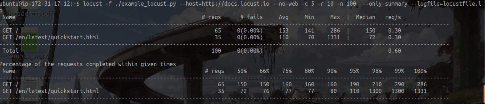

# Locust

## Stats

***Picture from terminal (single mode)***

* Table One:
    The data from the result of each user's request. Locust simulates each user and sends the http request independently.
* Table Two:
    > It shows the percentage of request completed given time interval which in table below means that 50% of the total requests to home is completed 160ms and 66% of requests are completed in 290ms and respectively goes on.

    > You can make a risk analysis about the performance of the services with this table for example to cover 99% 2sec needed but for 100% 14sec 1% of requests has very long time waiting.

    > If your target is to have 300ms at most, you can just cover the 66% requests so you will take the risk of your 34% percent of user to lose.

    [Explanation](http://stackoverflow.com/a/32869772)

***Picture from WEB UI***

* Statistics Page 
* Failure Page 
