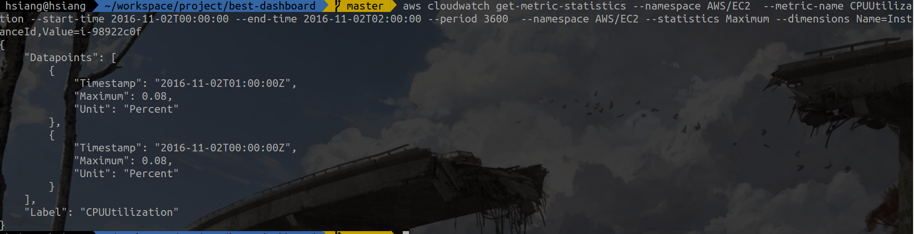

# Metrics

There are three approaches to collect the data of metrics of server / application.

1. Cloudwatch metrics (AWS)
2. Prometheus + exporter
3. Collectd

***None of above can provide streaming data***

1. AWS Cloudwatch provides aggregated metrics data and [*streaming Log*](https://docs.aws.amazon.com/AmazonCloudWatch/latest/logs/CWL_ES_Stream.html). That are two different functions. The streaming log refers to the log created by application or system. (Mesos log, Ubuntu syslog ...).
2. Prometheus and Collectd provides aggregated data with specific time interval (ex: 15 seconds) too.

## Summary


```
aws cloudwatch get-metric-statistics --namespace AWS/EC2  --metric-name CPUUtilization --start-time 2016-11-02T00:00:00 --end-time 2016-11-02T02:00:00 --period 3600  --namespace AWS/EC2 --statistics Maximum --dimensions Name=InstanceId,Value=i-98922c0f
```

As you can see, the data comes from AWS Cloudwatch. [According to the idea I described](solution_b.md), the customized Locust notifies the Consumer server that load testing is done. The Consumer server will start to download the metrics data from AWS Cloudwatch.
