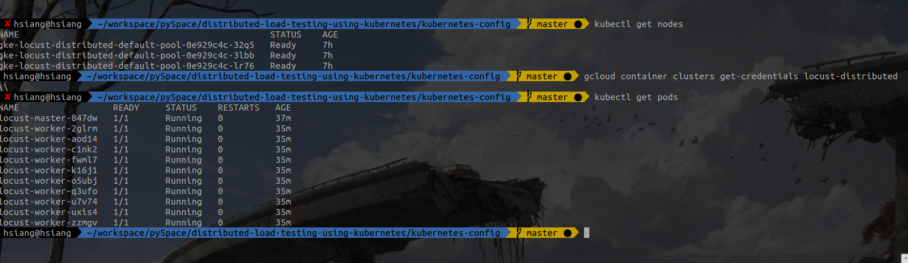

# Load Testing Environment

## Goal

Build a load testing environment.

## Requirement

* Query server metrics by different iterations.

## Flow

```{text}
Locust ---HTTP request--> WEB application --> Data(CSV format)
                            |
                            ---Metrics--> AWS Cloudwatch ----> Consumer

```

## Problem / Limitation

* There are two ways to get the data from Locust. One is downloading the csv files of data from Locust web UI and the other is check the terminal which will render the result of load testing by Locust. Both approaches are not scalable.(Require developer to check the result manually)

* Locust can not run distributed with the web interface disabled. The number of requests only can be defined under --no-web mode. There is no way to limit the number of requests from UI or terminal while the distributed locust cluster running.


## Solution

* #### A:
    * Write hook for each event (Request successful, failed...). Each event will triger the hook and sent the result to a centralized database. (Defined in the locust config file)
* #### [B](solution_b.md) (recommend):
    * Customize locust for our need. Sent the aggregated data to centralized database after each iteration finished.
    * Files: locust/main.py line 420, locust/stats.py line 32

## Demo

***Run distributed locust application on kubernetes.***


* [WEB UI](http://104.198.7.10:8089/)

* [Sample Web Page](http://dev-hyperpilot.appspot.com/)

## Reference:

* [Load testing with Locust](https://andrew-jones.com/blog/load-testing-with-locust/)
* [Sample Code of distributed-load-testing-using-kubernetes](https://github.com/GoogleCloudPlatform/distributed-load-testing-using-kubernetes)
*
