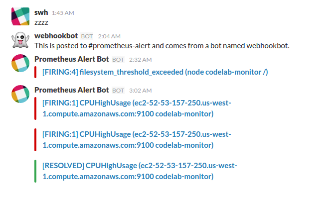

# Prometheus

# Dashboard

* [Grafana](http://52.53.209.251:3000/dashboard/db/prometheus-system)

`Prometheus officially recommend this data visualizatoin tool`

* [Prometheus node_exporter build-in dashboard](http://52.53.209.251:9090/consoles/node-overview.html?instance=localhost%3a9100), single node.
* [PromDash](https://github.com/prometheus/promdash) is a GUI-based dashboard builder based on Rails/SQL, [demo](http://52.53.209.251:4000/simple-dashboard)

# Alert Integration

* [Slack Alert](https://chatbot-dev.slack.com/messages/prometheus-alert/), `Need an invitation to access this channel`

```
# Load test.
ab -n 10000 -c 200 http://ec2-52-53-157-250.us-west-1.compute.amazonaws.com:8069/


# Check
# Slack channel, there must have one message about high CPU useage. https://chatbot-dev.slack.com/messages/prometheus-alert/
# Prometheus dashboard http://52.53.209.251:9090/alerts
# Prometheus Alertmanager http://52.53.209.251:9093/#/alerts

```



#References

* [Configuration, Digital Ocean](https://www.digitalocean.com/community/tutorials/how-to-use-prometheus-to-monitor-your-ubuntu-14-04-server)

* https://resin.io/blog/monitoring-linux-stats-with-prometheus-io/

* https://resin.io/blog/prometheusv2/

* [Configuration](https://github.com/resin-io-projects/resin-prometheus-server)
